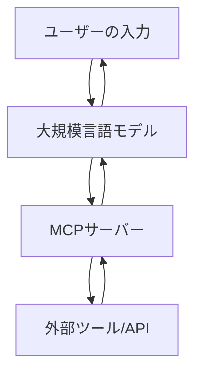

MCP サーバー（Model Context Protocol Server）は、大規模言語モデル（LLM）と外部ツールやデータソースを接続するための標準化された仕組みです。これにより、LLM がリアルタイムで外部情報にアクセスし、実世界のアクションを実行できるようになります。

---

## 🧠 MCP サーバーとは？

MCP（Model Context Protocol）は、LLM が外部のツールやデータソースと連携するためのプロトコルです。MCP サーバーは、このプロトコルに基づいて、LLM と外部リソースとの橋渡しを行います。

### 🧩 MCP の基本コンポーネント

- **Tool**: LLM が実行できる関数や操作（例：ファイルの作成、API の呼び出し）
- **Resource**: LLM が読み取ることができるデータ（例：ファイルの内容、API のレスポンス）
- **Prompt**: 特定のタスクを実行するためのテンプレート

---

## 🔧 MCP サーバーの仕組み

以下は、MCP サーバーの基本的なアーキテクチャを示す Mermaid 記法の図です。



この図では、ユーザーの入力が LLM に渡され、LLM が必要に応じて MCP サーバーを通じて外部ツールや API と連携し、その結果をユーザーに返す流れを示しています。

---

## 💡 実用的なコード例：ファイルへの書き込み

以下は、TypeScript を使用して、MCP サーバーでファイルにテキストを書き込むツールを実装する例です。

```typescript
// writeToFile.ts
import fs from "fs/promises";

export async function writeToFile(params: {
  filename: string;
  content: string;
}) {
  const { filename, content } = params;
  await fs.writeFile(filename, content, "utf-8");
  return {
    status: "success",
    message: `ファイル ${filename} に書き込みました。`,
  };
}
```

この関数は、指定されたファイル名と内容を受け取り、ファイルに書き込む処理を行います。MCP サーバーの Tool として登録することで、LLM からこの機能を呼び出すことが可能になります。

---

## 🔍 類似技術との比較

| 技術名     | 概要                                         | MCP との違い                                        |
| ---------- | -------------------------------------------- | --------------------------------------------------- |
| Plugin API | 特定のアプリケーションに機能を追加する仕組み | MCP は LLM と外部ツールを標準化された方法で接続する |
| Webhook    | イベント駆動で外部サービスと連携する仕組み   | MCP は LLM が能動的に外部ツールを呼び出す           |
| REST API   | リソース指向の API 設計                      | MCP は LLM との連携に特化したプロトコル             |

---

## 📝 まとめ

- MCP サーバーは、LLM と外部ツールやデータソースを接続するための標準化された仕組みです。
- Tool、Resource、Prompt の 3 つのコンポーネントで構成され、LLM の機能を拡張します。
- 実用的なコード例として、ファイルへの書き込みツールを TypeScript で実装しました。
- 他の技術と比較して、MCP は LLM との連携に特化したプロトコルである点が特徴です。

MCP サーバーを活用することで、LLM の可能性をさらに広げることができます。今後の AI アプリケーション開発において、MCP の理解と活用は重要な要素となるでしょう。

---

この記事が、MCP サーバーの理解と活用の一助となれば幸いです。さらに詳しい情報や実装例については、公式ドキュメントやコミュニティリソースを参照してください。

---
